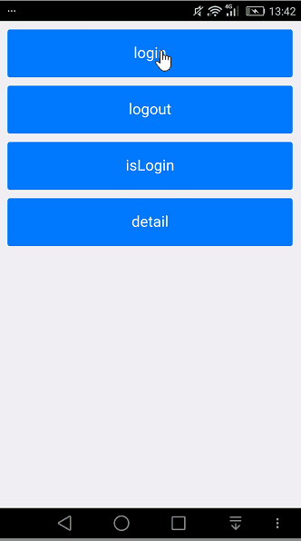

# AlibcSDKApplication

一个基于5+ SDK和阿里百川电商SDK的5+ plugin拓展。



## 文档

- 百川官方集成文档：http://baichuan.taobao.com/
- Android平台第三方插件开发指导：http://ask.dcloud.net.cn/article/66
- 5+ SDK Android API：http://www.dcloud.io/docs/sdk/android/

## 使用说明

1.生成证书文件 release.keystore;（Android Studio Build目录下的Generate Signed Apk）
2.使用证书打包生成apk文件; (app模块下signingConfigs字段配置，需要和证书打包时候对应)
3.将apk上传到阿里百川管理后台获取安全图片yw_1222.png.
4.集成电商sdk
```
dependencies {
    // fastjson
    compile 'com.alibaba:fastjson:1.2.9'

    // 支付
    compile 'com.alibaba.alipay:alipaySingle:20160825@jar'

    // 登陆
    compile 'com.ali.auth.sdk:alibabauth_core:1.1.4@jar'
    compile 'com.ali.auth.sdk:alibabauth_ui:1.1.4@aar'
    compile 'com.ali.auth.sdk:alibabauth_ext:1.1.4@jar'
    //【可选】仅供特殊合作伙伴使用
    // compile 'com.ali.auth.sdk:alibabauth_accountlink:1.1.4@jar'

    // 安全基础
    compile 'com.taobao.android:securityguardaar3:5.1.81@aar'
    //【可选】安全高级，如使用了发放红包、优惠券高级功能，则必须引入
    // compile 'com.taobao.android:securitybodyaar3:5.1.25@aar'

    // Mtop网关
    compile 'com.taobao.android:mtopsdk_allinone_open:1.2.2.4@jar'

    // applink
    compile 'com.alibaba.sdk.android:alibc_link_partner:1.1.0.0'

    // UT
    compile 'com.taobao.android:utdid4all:1.1.5.3_proguard@jar'
    compile 'com.alibaba.mtl:app-monitor-sdk:2.5.1.3_for_bc_proguard@jar'

    // 电商SDK
    compile 'com.alibaba.sdk.android:alibc_trade_common:3.1.1.107'
    compile 'com.alibaba.sdk.android:alibc_trade_biz:3.1.1.107'
    compile 'com.alibaba.sdk.android:alibc_trade_sdk:3.1.1.107'
}
```
5.根据电商SDK写5+ plugin

注意：AndroidManifest.xml文件下manifest=>package包名字段是应用的唯一识别码、在生成keystore文件以及安全图片后，如果更换了包名上述流程1-3需要重新进行。

## 视频教程

[html5+ App开发之 Android 平台离线集成 5+ SDK](https://segmentfault.com/l/1500000010042078?r=bPqXdU)

